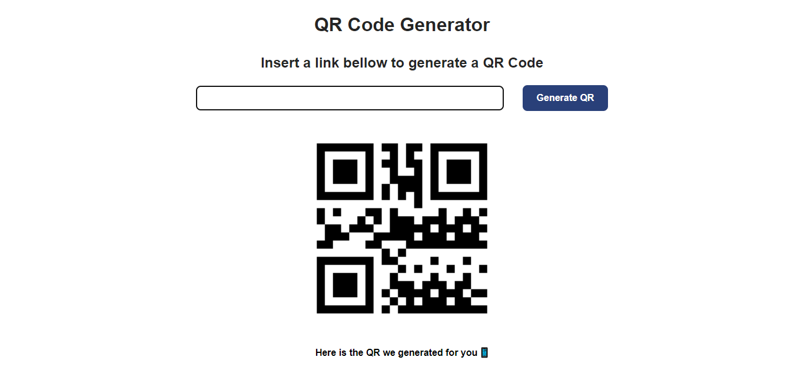

#   QR Code Generator

##  Requeriments

###   Install Flask
`
pip install Flask
`

###   Install QRcode
`
pip install qrcode[pil]
`

###   Install pybase64
`
pip install pybase64
`

##  View

    

